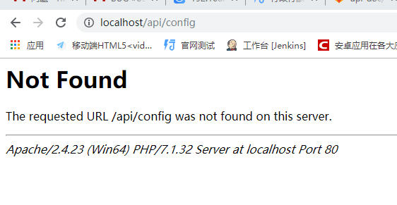

# Wampp 配置相关
### 新增php版本
~1 关键文件 phpForApache.ini、wampserver.conf  
  Wampp目录\bin\php
  a.拷贝已有php版本目录下的wampserver.conf文件分别到PHP各版本目录
  b.拷贝目录下的php.ini-development并重命名为phpForApache.ini
### apache 访问权限问题 
  
  ```
    -- 需要修改文件 httpd.conf
    AllowOverride All
  ```
